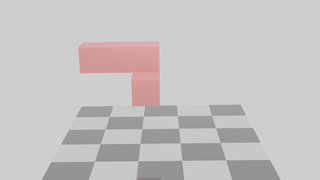

# Taichi

这里是 GAMES201 课程中一些算法的实现。

### Finite Element Methods
三维线性有限元模拟的实现，其中使用 Hyperelastic 材料模型。 fem_3d 为显式时间积分，fem_3d_imp 为隐式时间积分方法。
隐式时间积分方法中实现了两种不同的线性方程组求解方法：Jacobi 迭代法 和 共轭梯度法。
模拟结果导出到 .ply 中之后使用 Blender 进行渲染。

[三种不同数值方法的详细对比](https://github.com/YuCrazing/Taichi/tree/master/fem_3d_imp)

<!--  -->

### Vortex Methods

涡方法的简单实现。

<!--  -->

TODO: Fast multipole methods

### Eulerian Fluid

几种 advection 方法的对比：

<!--  -->

对 [Stable Fluid](http://graphics.stanford.edu/courses/cs468-05-fall/slides_2/an_stable_fluid_fall_05.pdf) 的实现。

<!--  -->

### Hybrid Fluid

数个网格-粒子混合流体模拟方法的实现，包括：Particle-In-Cell (PIC), Affine Particle-In-Cell (APIC), Fluid Implicit Particles (FLIP), Material Point Methods (MPM)

<!--  -->

**UPDATE**:

* PIC 中新增了 Velocity Extrapolation 以及 Vorticity Enhancement 操作，以优化模拟效果。 

### Material Point Methods

MPM 算法模拟多种材料。

<!--  -->

### Multigrid Methods
使用 Multigrid Methods (V-cycle) 求解 PIC 中的压力项。
需要注意边界条件的处理，在做全局的 smooth 前后，需要对边界部分进行单独的 smooth 。

<!--  -->

TODO: multigrid conjugate gradient
