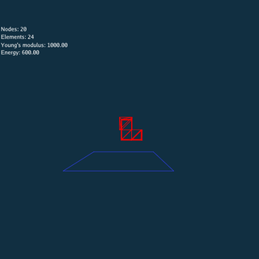
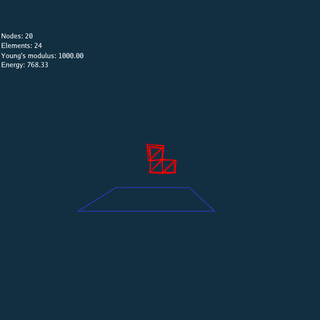
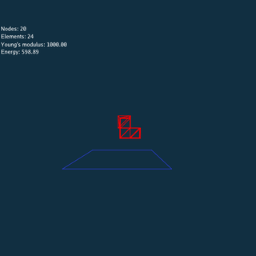
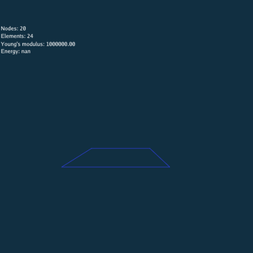
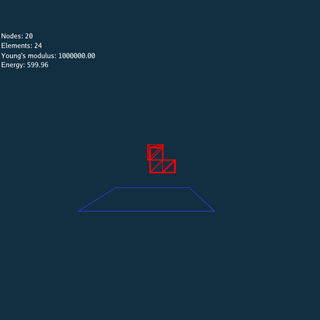
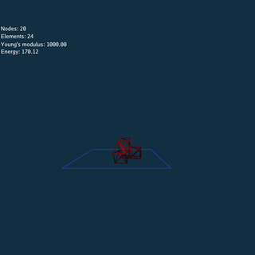

## Introduction
An implementation of 3D linear FEM based on Neohooken elasticity model.

Three different numerical method are implemented respectively, include:
- Explicit Time Integration
- Implicit Time Integration
    - Jacobi Method
    - Conjugate Gradient Method

Environment: `Taichi 0.6.15`
<!-- Comparison between three method is presented as below: -->

## Simulation Results

<!--  -->

Rendered by Blender.

## Analysis

<!-- ### Same Scene -->
<!--  -->
<!--  -->
<!--  -->

### Large Time Step
 
 
 

### Large Young's Modulus
 
 
 

### Problems of Conjugate Gradient Method

<!-- 1. Rotation -->
 
 

<!-- | Tables   |      Are      |  Cool | -->
<!-- |----------|:-------------:|------:| -->
<!-- | col 1 is |  left-aligned | $1600 | -->
<!-- | col 2 is |    centered   |   $12 | -->
<!-- | col 3 is | right-aligned |    $1 | -->
