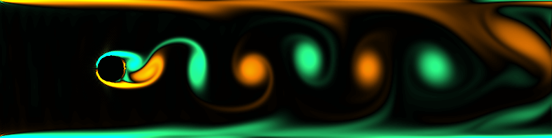

### Lattice Boltmann method (D2Q9 model)

Inspired by [hietwll/LBM_Taichi](https://github.com/hietwll/LBM_Taichi) .

### References

[Lattice Boltzmann Method for Fluid Simulations](https://www.math.nyu.edu/~billbao/report930.pdf)